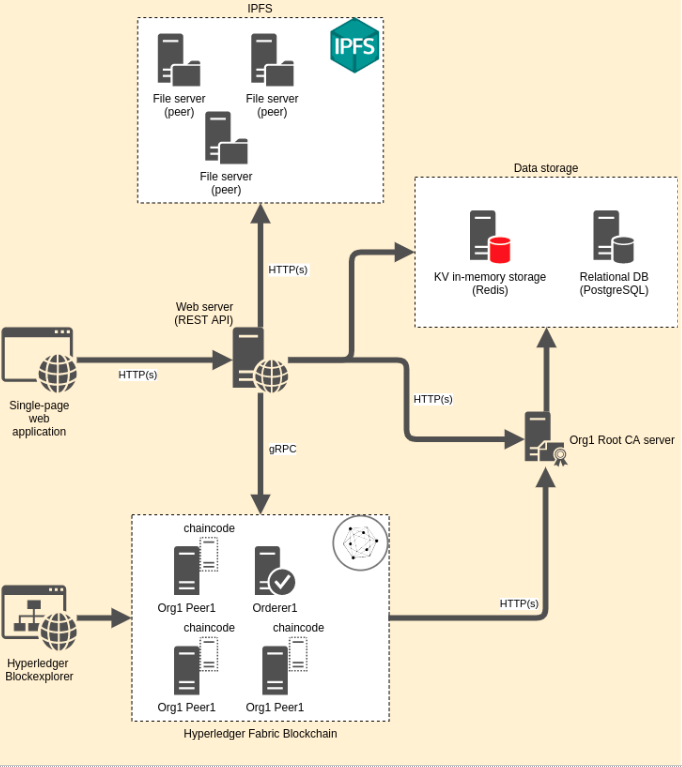

# Lab Name 

 Electrodo.Docs

# Table of Contents

- [Lab Name](#lab-name)
- [Table of Contents](#table-of-contents)
- [Short Description](#short-description)
- [Scope of Lab](#scope-of-lab)
- [Initial Committers](#initial-committers)
- [Sponsor](#sponsor)
- [Pre-existing repository](#pre-existing-repository)
- [\[Remarks\] Solution Architecture](#remarks-solution-architecture)
- [Other links](#other-links)
    - [1.  Frontend layer ](#1--frontend-layer-)
    - [2.  Backend layer](#2--backend-layer)
    - [3.  Blockchain layer ](#3--blockchain-layer-)

# Short Description 

Electrodo is a Web3 platform for ESG data, asset, and risk management, helping companies and investors create sustainable value and improve the efficiency of sustainable capital allocation. By addressing ESG data availability, integrity, and reliability issues, Electrodo streamlines the ESG asset management, such as tokenized clean energy, carbon emissions, carbon credits, ESG stocks (shares),  etc.

Electrodo digitizes and automates the collection, processing, verification, and sharing (disclosure) of financially material ESG data between the double-pole stakeholders (industrial producer and investor) value chain by obtaining and processing data from various sources with data notarization and verification on a blockchain.

Electrodo solves the problem of ESG data availability, completeness, integrity, and reliability for ESG (climate-related) data and risk management, as well as contributes to the resilience and sustainability of the industrial value chain. Using our solution, industrial companies can collect and manage ESG data, and as a result, identify, assess, and manage ESG (climate-related) risks, thus implementing an ESG strategy to mitigate disruptive climate changes.

Moreover, SMEs can set their own ESG impact targets and follow up on their progress, where those targets and progress measures may also be accessed by investors, asset managers, or private equity funds interested in investing and allocating capital in those sustainable businesses. This demonstrates the understanding and ability to effectively manage a business with a simultaneous positive impact on ESG factors.

# Scope of Lab 

In Hyperledger Labs, we develop an Electrodo.Docs (Fig. 1) - document management service of Electrodo platform.

Electrodo.Docs is a document management service designed for Electrodo platform users. Integrated with technologies such as Hyperledger Fabric and IPFS protocol, this service enhances the ESG/Sustainability disclosure process, ensuring transparency, security, and ease of management throughout the reporting lifecycle.

**Key Features & Functionalities.**

1. **ESG Document (Data/Context) Management.**

With the rapidly evolving ESG landscape, the need for a streamlined, organized, and secure document management system. Electrodo.Docs offers a platform where users can efficiently manage their ESG-related documents. This includes storing, retrieving, updating, and archiving vital records, ensuring that data remains consistent, accurate, and easily accessible.

2. **Document Notarization with Blockchain/IPFS.**

One of the standout features of Electrodo.Docs is its ability to notarize documents. By leveraging the decentralized capabilities of blockchain and the InterPlanetary File System (IPFS) protocol, the service ensures that every document's authenticity is verifiable. When a document is uploaded, a unique cryptographic hash is generated and stored on the blockchain, while the document itself resides on IPFS. This ensures that the document remains tamper-proof, providing an additional layer of security and trust.

3. **Self-Verification Services.**

In the digital economy, the ability to verify the authenticity of documents independently is crucial. Electrodo.Docs offers a self-verification service, allowing stakeholders to confirm the integrity and authenticity of any document stored within the system. By comparing the cryptographic hash of the document with the one stored on the blockchain, users can ensure that the document hasn't been altered since its notarization.

4. **Decision-Making with a Voting Mechanism.**

Collaborative decision-making is pivotal in ESG/Sustainability reporting. Electrodo.Docs incorporates a voting mechanism, facilitating consensus-driven decision-making. Stakeholders can propose changes in ESG strategy, and through a transparent and democratic voting process, the most supported decisions get implemented, ensuring collective agreement and collaboration.

Functionality of open voting is just about: vote and see the voting results, which could be used for instance to decide if some amendments should be accepted or not. 

The user has ownership rights for folders created by him and files uploaded by him. The owner can share access for viewing, editing files and folders or even transfer his ownership. With the ownership, the user can start voting on a specific file, where he selects the voting participants, voting options and time for completion of voting.

# Initial Committers 

_Enter the Github IDs for the set of initial committers._

1. https://github.com/bismerk
2. https://github.com/andrii482
3. https://github.com/alexshehovcov
4. https://github.com/Dmitrii-Kholodov
5. [https://github.com/roman-kravchenko](https://github.com/roman-kravchenko)
6. [https://github.com/linababenko](https://github.com/linababenko)
7. [https://github.com/Ursyyy](https://github.com/Ursyyy)
8. https://github.com/boivlad482

# Sponsor 

[482.solutions](https://482.solutions/) is a Singapore-based international company with headquarter in Ukraine, specializing in the development of industrial Web3 and blockchain-based solutions for the Green Energy, Green Finance, and Sustainable Value Chain sectors.

# Pre-existing repository 

The reason of merging ElectrodoDoc-server-js repository within ElectrodoDoc-meta repository based on wish to share main functionality of platform with Open Source community and  other points:

* vitally important business logic and integrations located in ElectrodoDoc-server-js repository (and can be used as an API for mobile and Web applications)
* other components are modular and can be replaced.  \
(Like, for example, "Hyperledger Fabric network" component - where network configuration may vary depending on business needs) \

1. [https://github.com/482solutions/ElectrodoDoc-meta](https://github.com/482solutions/ElectrodoDoc-meta)
2. [https://github.com/482solutions/ElectrodoDoc-server-js](https://github.com/482solutions/ElectrodoDoc-server-js) 

# [Remarks] Solution Architecture 

([https://github.com/482solutions/ElectrodoDoc-server-js/blob/master/docs/Architecture.md](https://github.com/482solutions/ElectrodoDoc-server-js/blob/master/docs/Architecture.md))

1. Database Tier - the database level is used to implement IAM (Identity Access Management) and manage users - storing logins, passwords, Hyperledger Fabric certificates and IPNS (InterPlanetary Name System) private keys. This is done for the convenience of using the system through the API and eliminating the need for the user to install additional software for working with Hyperledger Fabric and IPFS (interPlanetary File System).
2. Server Tier - includes REST API, business logic, interaction with services and the database.
3. Client Tier - this layer includes: additional logic for encrypting user passwords, as well as sending requests to the server. The client uses the library generated by Swagger which provides a set of methods for sending REST requests.
4. Permission service - for managing file and directory access rights it works on the Hyperledger Fabric private blockchain. This service has the following functionality:
* The user can give rights to view and update directories and files to other users.
* User can view file permissions.
* The user can get a list of directories and files available to him with an indication of their owners.
5. Resource service - provides distributed storage of user files and directories. IPNS is a distributed registry for files and directories. The principle of IPNS is that users publish a fixed resource address, which is stored in IPFS, signed with a key from a public-private key pair. Updating an entry in IPNS can only be done with the same key that was used to create the entry. This system allows you to give a permanent address to the resource when it is updated, which is necessary because resources in IPFS are addressed by their hash (content ID, CID) and when the file is updated, its CID changes.

---

# Other links

___
###  1. <u> Frontend layer </u>
- ##### UI: 
    https://github.com/482solutions/ElectrodoDoc-ui
___
###  2. <u> Backend layer</u>

- ##### Client writing in JS:
    https://github.com/482solutions/ElectrodoDoc-api
___
###  3. <u> Blockchain layer </u>
- ##### Blockchain network builded via Hyperledger Fabric framework:
    https://github.com/482solutions/ElectrodoDoc-network
- ##### Block Explorer for Hypereldger Fabric Network:
    https://github.com/482solutions/ElectrodoDoc-explorer

